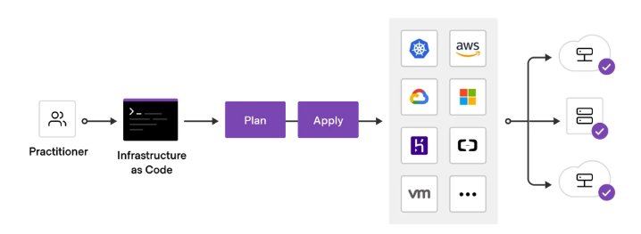

- Cloud Container Image Usage
- What is Terraform
- Terraform Core Concepts
- Terraform Use Case
- Terraform Infrastructure
- Terraform CLI
- Project Structure
- Tool - tfenv usage
- Example - Terraform manage AWS ECR


- Cloud Container Image Usage
  - Private Repository Image: fbrdevacr.azurecr.io/app/order-service:latest
  - Public Repository Image(Docker Hub): nginx:latest
- What is Terraform
  - Terraform is an open-source Infrastructure as Code (IaC) tool created by HashiCorp. It enables you to define and provision infrastructure using a declarative configuration language known as HashiCorp Configuration Language (HCL), or optionally JSON.
  - Key Features
    - Infrastructure as Code
    - Execution Plans
    - Resource Graph
    - State Management
    - Multi-Cloud Support
    - Declarative Language
  - How Terraform Works
```
Write Configuration → Initialize → Plan → Apply → Manage State
       (HCL)           (init)    (plan)  (apply)    (state)
```
- Terraform Core Concepts
  - Providers
  - Resources
  - Variables
  - Outputs
  - Data Sources
  - Modules
- Terraform Use Case
  - Multi-Cloud Deployment
  - Application Infrastructure Provisioning
  - Kubernetes Cluster Management
  - Self-Service Infrastructure
- Terraform Infrastructure

- Terraform CLI
  - install: brew install hashicorp/tap/terraform
  - verify installation: terraform version
  - essential Commands
    - terraform init
    - terraform validate
    - terraform fmt
    - terraform plan
    - terraform apply
    - terraform destroy
    - terraform show
    - terraform state
    - terraform output
    - terraform import
    - terraform providers
    - ......
- Project Structure
```
.
├── main.tf           # Primary resource definitions
├── variables.tf      # Input variable declarations
├── outputs.tf        # Output value declarations(/ˌdekləˈreɪʃn/)
├── versions.tf       # Terraform and provider version constraints
├── terraform.tfvars  # Variable values (gitignored if sensitive)
├── modules/          # Local modules
│   ├── networking/
│   ├── compute/
│   └── database/
└── environments/     # Environment-specific configurations
    ├── dev/
    ├── staging/
    └── prod/
```
- Tool - tfenv usage
  - installation: brew install tfenv
  - common commands
    - tfenv list-remote | grep 1.6
    - tfenv install 1.6.6
    - tfenv list
    - tfenv use 1.6.6
    - tfenv uninstall 1.6.6
- Example - Terraform manage AWS ECR
  - install AWS CLI: brew install awscli
  - terraform management